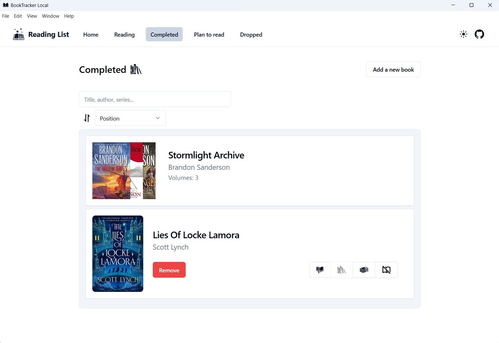
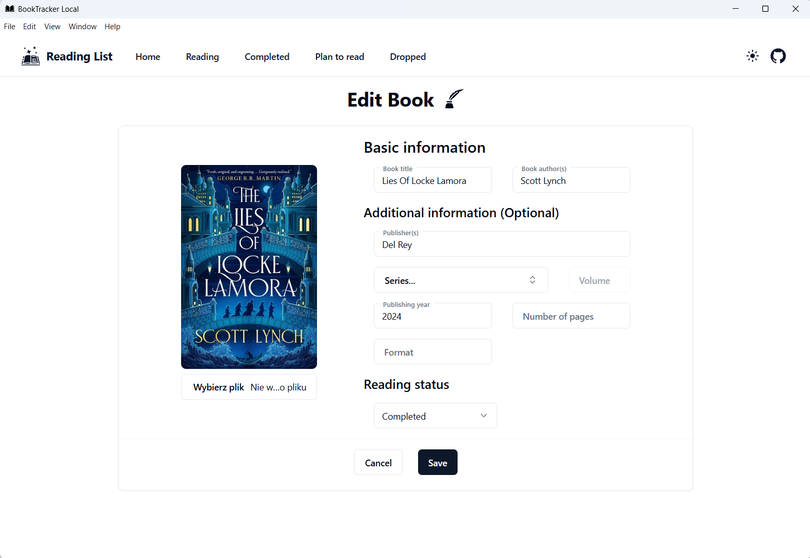
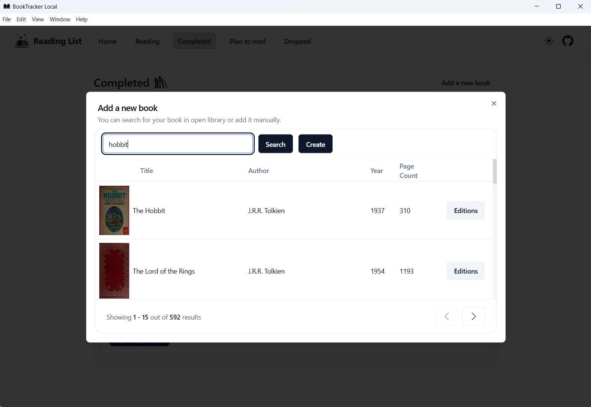
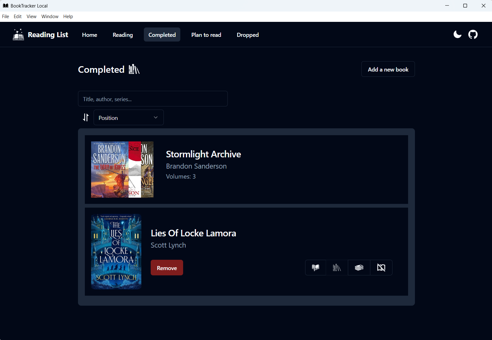

# Book Tracker Local

A desktop application for managing your personal book library. Add, edit, search, and organize books and their covers.
Works locally, but internet is needed for some features.

## Features

- Add, edit, and delete books
- Browse books by status (Completed, Reading, Plan to Read, Dropped)
- Search for books (needs Internet)
- Books can be organized into series
- Cover image support (select file, save locally, default covers need internet)
- Local data storage
- Export and import library data as JSON
- Dark mode support






## Installation

### Windows

Windows installer is provided in [Releases](https://github.com/dawid-walkiewicz/book-tracker-local/releases/latest).

### Other Platforms

Installers for macOS and Linux are not currently provided. Follow the instructions below to build and run the app from
source.

1. **Requirements:**
    - Node.js (recommended LTS version)
    - npm or yarn

2. **Install dependencies:**
   ```cmd
   npm install
   ```

3. **Build production app:**
   ```cmd
   npm run electron:build
   ```
   If you encounter issues, try running the command prompt as administrator.
   After building, the installer can be found in the `dist` folder.

4. **Install app**

## Project Structure

- `src/` – React + TypeScript source code
- `electron/` – Electron main and preload scripts
- `public/` – Static assets
- `assets/` – Images and icons
- `components/` – UI components
- `Pages/` – Page views
- `bookLists/`, `bookSearching/`, `ui/` – feature modules
- `libraryStore.ts` – data storage logic
- `vite.config.ts` – Vite configuration
- `tailwind.config.js` – Tailwind CSS configuration

## Support

If you have issues or questions, open an issue in the repository or contact the author.
Unfortunately, this is not a priority project, so support may be limited.

## License
This project is licensed under the MIT License. See the [LICENSE](LICENSE) file for details.

